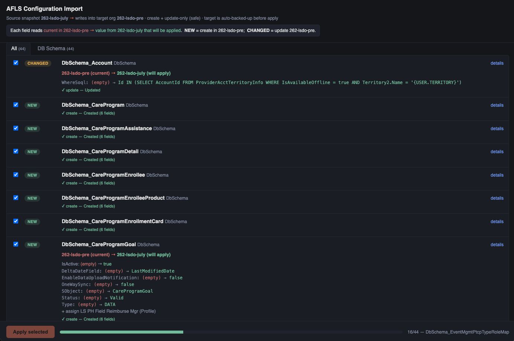

# Metadata Import

Promote AFLS **configuration** (not data records) from one org to another — Admin
Console settings, DB Schema, trigger handlers, and quick/custom actions. Import is
**diff-driven** and **create + update-only (safe)**: it compares a snapshot against
the live target, applies only what you select, and **never deletes, deactivates, or
blanks** anything that exists only in the target. The target org is **auto-backed-up**
before a single write.

> For loading **data records** (accounts, HCPs, territory assignments) use
> `afls-data-migration` instead. This page is about configuration metadata.

---

## The workflow at a glance

```
export_config (source org)          import_config (target org)
        │                                     │
        ▼                                     ▼
  exports/<snapshot>.json  ──►  diff  ──►  review  ──►  apply
                                 │           │            │
                          NEW / CHANGED   web UI or   create + update
                          IDENTICAL /     report      (backup first)
                          TARGET_ONLY
```

1. **Snapshot the source.** `export_config({ targetOrg: "sourceAlias" })` writes an
   `exports/*.json` snapshot (format **v1.1** — captures each field's `DataType` and
   profile/permission-set assignments).
2. **Diff against the target.** `import_config` flattens both sides, matches records by
   `DeveloperName`, and classifies each one.
3. **Review** — in the browser UI or as a text report.
4. **Apply** the records you chose. The target is backed up, then only creates and
   updates run, with live progress.

---

## The three modes

`import_config` takes a `source` (a saved `exports/*.json` path, inline JSON, or a
live `sourceOrg` to snapshot), an optional `targetOrg`, and a `mode`:

| Mode | What it does |
|------|--------------|
| `report` *(default)* | Computes the diff and returns a summary (New / Changed / Identical / Only-in-target). Writes the full structured diff to `exports/import-diff-*.json`. No writes to the org. |
| `ui` | Spins up a **local browser UI** (127.0.0.1, token-protected, single session) with per-record checkboxes, field-level before → after, filters, and an **Apply selected** button that writes back live with streaming progress. Returns the URL. |
| `apply` | Applies a specific `selection` of record keys headlessly (this is the same code path the UI's Apply button calls). |

Typical use: **report first**, then hand the user the **`ui`** URL for a large or
mixed changeset, or call **`apply`** with an explicit selection for a small, well-understood set.

---

## The review UI

`mode: "ui"` returns a `http://127.0.0.1:<port>/?t=<token>` URL. Open it in a browser:



### Reading the screen

- **Header** — states the direction: *source snapshot → writes into target org*, and
  reminds you the policy is create + update-only and the target is auto-backed-up.
- **Legend** — the key to every field row: `current in <target>` → `value from
  <source> that will be applied`. On each row the **left (red)** side is what the
  target has *now*, and the **right (green)** side is what will be written.
  `NEW` = create in the target; `CHANGED` = update the target.
- **Tabs** — records grouped by area (Trigger Handlers / DB Schema / Actions / Admin
  Settings), with an `All` tab. The count in each tab is the number of *actionable*
  (New + Changed) records.
- **Filters** — a name search and a status filter (All / Actionable / New / Changed /
  Identical / Only in target). **Select all shown** ticks every actionable row that
  matches the current filter.
- **Rows** — a checkbox, a status badge, the `DeveloperName` + category, and a
  **details** toggle. Expanding a row shows a per-record caption
  (`<target> (current) → <source> (will apply)`) above the field-level changes.

### Status meanings

| Badge | Meaning | Applied? |
|-------|---------|----------|
| `NEW` | In the snapshot, missing from the target | ✅ created (except trigger handlers — see gotchas) |
| `CHANGED` | In both; a field, assignment, or `IsActive` differs | ✅ updated |
| `IDENTICAL` | In both; no source-driven difference | — no-op (not selectable) |
| `TARGET_ONLY` | In the target only | 🚫 left untouched (safe policy) |

### Applying

1. Tick the records to apply (New + Changed are pre-checked; Identical and
   target-only are locked).
2. Click **Apply selected** and confirm. Before any write, the target is snapshotted
   to `exports/backup-<target>-<stamp>.json`.
3. Progress streams live — the bar and footer show `n/total — <record>`, and each row
   gets a ✓/✗ result (`create — Created (N fields)`, `update — Updated`, etc.).
4. When it finishes, a result log is written to
   `exports/import-result-<target>-<stamp>.json`.

Apply runs **once per UI session**. To run again, start a fresh `import_config` call.

---

## What "safe" guarantees

- Only **create** (missing records) and **update** (changed fields, additive profile
  assignments, `IsActive`) ever happen.
- **Target-only records are never touched**, target-only fields are kept, and
  target-only assignments are kept.
- An **empty source value never overwrites a populated target field** — blanking a
  field is a form of deletion, so it is skipped. (`false` and `0` are treated as real
  values and *are* applied.)
- **Trigger handlers can only be toggled** (`IsActive`) — a handler in the source but
  absent from the target is reported, not created.
- The target is **backed up first**, and every apply writes a **result log**.

---

## Files written to `exports/`

| File | When | Contents |
|------|------|----------|
| `<category>-export-<org>-*.json` / snapshot | `export_config` | The source snapshot (v1.1). |
| `import-diff-<target>-*.json` | `report` mode | The full structured diff. |
| `backup-<target>-*.json` | before every apply | The target's current config for the affected categories. |
| `import-result-<target>-*.json` | after every apply | Per-record apply outcome (applied / failed / skipped, warnings). |

---

## Snapshot format & versions

- **v1.1** (current) stores, per record: `category`, `fields` (name → value),
  `fieldTypes` (name → Tooling `DataType`), and `assignments`. The `DataType` lets
  import write each value into the correct Tooling value column on create.
- **v1.0** snapshots (no `fieldTypes`) still import — types are **inferred**, reliably
  for DB Schema (fixed field map) and best-effort elsewhere. Prefer re-exporting at
  v1.1.

Records are matched between orgs by **`DeveloperName`**. Renaming a record between
orgs therefore looks like a delete + create, not a rename.

---

## Security model (the UI can write to a live org)

- Binds to **127.0.0.1** on an ephemeral port — never a public interface.
- Every request must carry an **unguessable per-session token** (`?t=` or the
  `x-afls-token` header); requests without it get `401`.
- If an `Origin` header is present it must match the server's own origin — foreign
  origins get `403` (blocks drive-by requests from other local pages / CSRF).
- **One active session at a time**; starting a new one closes the previous server.
- **Idle (15 min) and max-lifetime (1 hr) timers** shut the server down automatically.

---

## Gotchas

- **DB Schema / action changes need a mobile metadata cache regeneration** to take
  effect on the iPad app — run `generate_mobile_metadata_cache` afterward.
- **Trigger handlers can't be created** — only existing ones can be toggled.
- **Confirm direction before applying.** Never assume production is the target — the
  header and legend always name both orgs; read them.
- **Verify after** — re-run `import_config` in `report` mode (or `diff_orgs`) and
  confirm the applied records now show `IDENTICAL`.

---

## Related

- `/afls:export-config`, `/afls:import-config`, `/afls:diff-orgs`
- Skill: `afls-config-migration` (guides the export → diff → selective-import workflow)
- Skill: `afls-data-migration` (for **data records**, not configuration)
